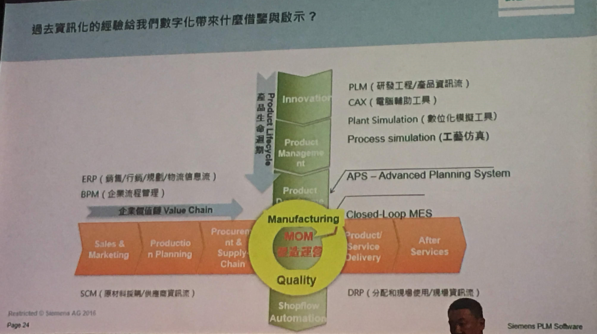

2018 CIO 製造論壇

***

第一次參加論壇，AI 學校的陳昇瑋執行長再次介紹了AI 的部分，多了AI 導入的階段。另外對於機器學習的體認也更深了一點。對於製造業來說資料收集上對於老舊機台的資料收集與聯網一直是多數公司面臨的第一個問題。也是做關鍵的一步，如何小投資大收益與建立信心始終是一個難題。虛擬桌面的技術又回到先前大型Sever 的概念不過技術上可行，語音與視訊傳遞的品質與混合一邊語音線路的方式也是一個點。會議中豔驚的是raspberry pi 代替 thin client 最近公司在替換 PC 倒是一種思考方式。至於產品設計智能化大量運用模擬方式加快量產與設計時程這個solution 依該還在貴族企業可以玩的階段吧 !

機器學習適合什麼任務

+ 明確定義因果關係輸入 X & 輸出 Y
+ 不需要豐富背景知識或很長邏輯推理鏈
+ 能提供明確反饋與大量模擬
+ 容錯性不需要100% 正確

先進製造技術應用

+ Mobile
+ Social
+ IoT
+ BigData / AI
  + 預測分析
  + 高運算
+ 數位整合
  + 機器人
  + AR/VR

AI 常見應用

+ 瑕疵檢測
+ 控制設備參數
+ 預防保養預估
+ 原料組合

AI 導入建議

Step 1 資料收集由機台或是 Sensor 經由 GetWay 

Step 2 資料儲存關連到資料庫結構化或是非關聯式資料庫

Step 3 建模與分析預測大數據分析與 AI 

Step 4 儀錶板與視覺呈現

智慧供應鏈- 消費者為中心

產品設計與製造流程整合

