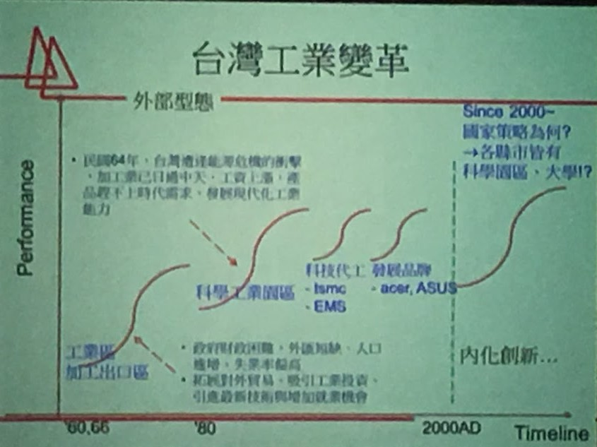
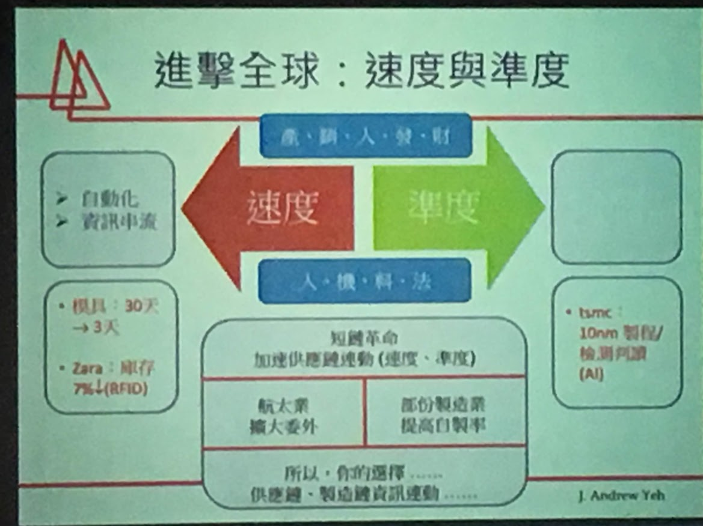

台灣人工智慧學校 -DAY ONE

***

台灣製造的今日與明天,葉哲良教授由Ecomomy Cycle 來看今日的台灣, 資訊軟體業 10 年一個 cycle. 汽車業 40 年而電子業 8 年。**台灣在科學園區這個 S 曲線後，只有量變但沒有質變**。2000 年後我們依然未找到下一個S 曲線。

台灣南北發展下也呈現不同策略思維。產業面上來看生命週期的不同引發不同的作法。國際化 VS 西進。經理人 VS 二代接班。硬體製造業的轉型。軟體在企業主中普遍是以費用而非加值與競爭利器的思維是否改變與調整。美中關係下，**短鏈革命的趨勢垂直整合、速度與準度。****在產品的生命週期下發展的角度要所不同。回到核心競爭力下該重視什麼 ? ** 例如同樣是汽車製造，VW 與 Ferrari 會有所，產量、客戶重視的點都不同。

人工智慧導入的評估面相由：製造(人機料法)、管理(產銷人發財)、市場需求面(價值定位，夥伴資源，客戶關係，行銷資源，創新模式)；搭配產品生命週期應該要有不同的思維與架構。老話一句核心競爭力是什麼 ? AI 是工具幫助我們強化核心競爭力。

> 機器學習要歷史中學習但不能從歷史學錯誤
>
> 智慧製造去人性化的變異
>
> 模擬人性的變思
>
> 標準化，系統化，自動化，資訊化，智慧化

