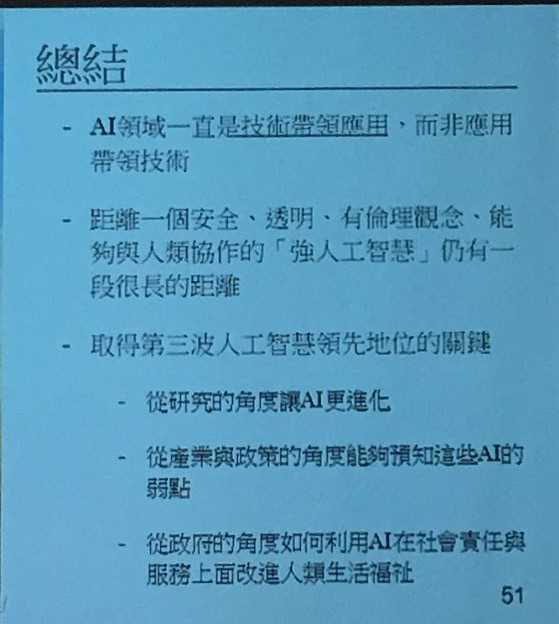

#### AI Next

***

這 2 週跑了2 趟台北，也自費參加了一次研討會主題都是關於 AI。學者們都不約而同地提到**轉型人才是關鍵**。不知道老闆們聽進多少 ? AI 的下一步，**資安與道德議題會是重點**。回到現實問題，企業如何引進 AI  台大林守德教授提到**AI 在企業落地，人才方面可區分幾個階層**，產學合作是一個很好的方式。

+ AI 應用(會用工具 R , Python ...)
+ AI 系統(雲端架構，硬體整合)
+ 企業 AI 高階人才(知道企業有什麼資料，如何應用AI 的技術)
+ AI 演算法

> 人工智慧的思維是對人的服務，獨到的技術與商業模式搭配雲端架構將導致贏者全拿。Niche Marke 是很重要。

資料與大數據是AI 的養分與基礎。資料盤點甚為重要。如同 KPMG 提倡的資訊鑑別

+ 組織如何搭配
+ 科技帶來的衝擊與機會
+ 產業與企業該如何應用，破壞式的跨界競爭已經不是新聞

