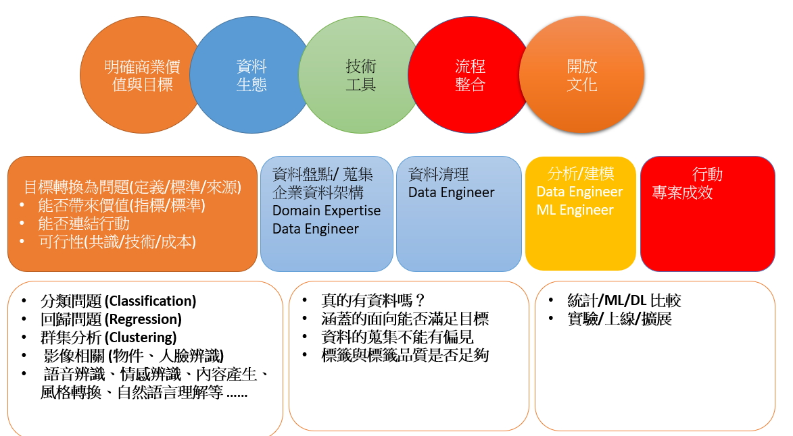

AI 轉型

***

AI 學校經理人班結業了,今年以來公司開始計畫引進 AI 的相關技術,稍微整理一下.

AI 導入的步驟以公司層級,由中階主管發動的 Project 往往會失敗因為 ,往上不見得可以要到資源, 往下無法說服同仁執行。要找對人針對內外客戶的需求來擬訂問題。考量人機協作的方式來獲取最大的效益與不段的優化模型。

> 1. Execute pilot projects to gain momentum
>
>   明確的商業目標與價值,快速獲得短期成果,新工作的組織團隊與角色,AI 能做什麼與不能做什麼,AI 團隊,AI 與公司策略的結合與數位資產
>
> 2. Build an in-house AI team
>
>    建立可重複的流程來持續執行計畫,建立公司層級的通用平台,
>
> 3. Provide broad AI training
>
>    翻轉教學,利用線上與專家諮詢
>
> 4. Develop an AI strategy
>
>    以企業核心競爭優勢為主要的發展目標,集中支援
>
> 5. Develop internal and external communications 

在開始之前

> Colloquially, the term "artificial intelligence" is applied when a machine mimics "cognitive" functions that humans associate with other human minds, such as "learning" and "problem solving.
>
> A type of algorithms giving computers the ability to learn from data rather than being explicitly programmed 
>
> Scientists discover the world that exists; engineers create the world that never was.

Reference [AI 巨頭吳恩達發布《AI 轉型指南》：五大步驟教 CEO 如何從零開始 AI 計畫！](https://buzzorange.com/techorange/2018/12/14/ai-transformation-playbook/?utm_source=TOLINEING_1214_ai-transformation-playbook) 許懷中_在引入 AI 之前，企業必須知道的資料分析與機器學習實務 陳昇瑋人工智慧民主化在台灣 

