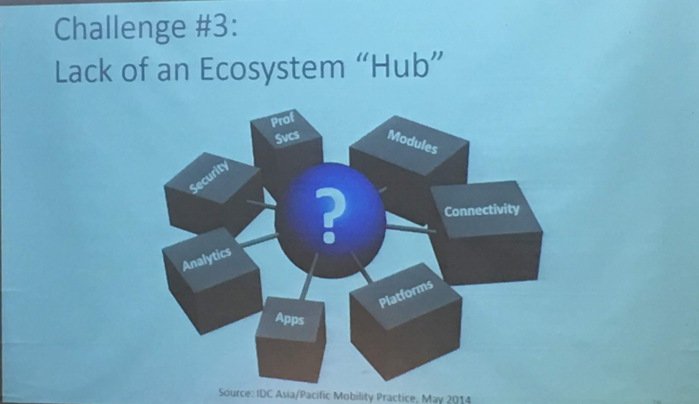

AI 的商業模式

***

週五跟周六連兩天參加了 2 個研討會，分為逢甲大學與東海大學舉辦關於人工智慧與機器學習的討論。 美光由品質的角度切入AI ,建立跨領域團隊，對於**溝通的成本最貴**確實界解獨到 先前學習 R 的時候,就拜讀過陳景祥教授的分享與資源,這演講對教授平常的嗜好與研究映像深刻，很少老師親自動手的實力這樣驚人的，況且老師主要的研究是數理非工程與機械。而這些應用都與 AI 有關 桑慧敏教授則是另一種風格，有哲學的味道, 以**系統性的思考與邏輯來解決問題**，**探求根源以終為始，了解資料來源與收集條件，在整個流程中還有哪些可能。套 Model 不是依樣畫葫蘆要了解內涵。很多時候簡單的方法就可以解決很多問題。耐心的傾聽問題**。資料分析要用對圖表思考**目的**是什麼 ? 幾個淺顯易懂的生活案例來解釋十分受用。**SVM 用 7-11 的熟食袋子來解釋。**

+ DOE 主要的觀念
  + 反應值
  + 因子(相關 VS 因果)
  + 區隔變數(避免混淆)

東海大學智慧講座，是黃齊元學長所捐助，剛好 AI 學校停課所以有機會過去聽。 上午陳亮恭教授分享到**有些狀況下 Unspervied learning better than suppervied learning**,也是一個根據目的選擇工具,因為醫生是非常專業的工作又依靠人的判斷,所以**溝通的成本最貴, 想好 Business Model 否則很容易陪光光 賴柏雄教授分享到 **AI 投資的策略，**管理系統賺不到錢，雖然解決基層人員的 loading** ,強調的應該是 **Value up 不要 focus cost down**, **AI 投資你懂我懂大家懂, 不要碰**，要往深的地方走,我很喜歡中西思想異同的方式,商業的 Business Model 角度思考與 Ecosystem. **AI 目前沒有標準是困難也是機會**.賴教授的東西很有價值要消化好久 下午比較提到 Digital Transformation, 比較以科技驅動變革, 如何因應與生態系統的角度

        