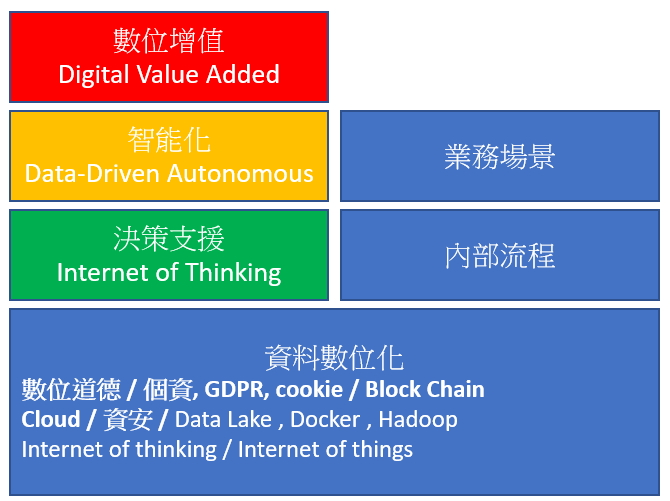

2018->2019 CIO 趨勢大調查

***

參加了 CIO 雜誌舉辦的 2018-2019 的年度發表, 回顧幾個 18 年重要的議題,。消化一下最近的一些片斷吸收到的。數字經濟(數位經濟邊際成本幾乎為零), 這是一種新的模式,18 年大量免費的智能軟體與工具，讓資料科學的門檻降低驅動了這波的變革。我覺的 AI 在 19-20 年會面臨泡沫但會有蠻多的東西落地。

智能化希望由資料驅動,最好能自主的完成流程,進而驅動增值。因應的架構與技術就是目前火熱的幾個口號，AI , Big Data , Cloud. 企業導入的評估與面向就多了, Quick win 在企業現實面是必須的,畢竟沒成效,英明的老闆們不會投資。今天有提到一個有趣的觀點,程式是公司的商業流程, **用 AI 來分析程式,優化流程與補足缺陷**, 。Block Chain 強調信賴與去中心化，IT 目前主流架構與管理機制是中心化,這中間就有很多可以思考的點。這張圖想好久,也不滿意, 想表達的是目標配合的技術與價值增值。

17 與18 年調查分析比

+  主管面臨的問題內外夾攻與人才依然缺乏,人才方面,透過產學合作或許是個機會，(**互補學校需要 Data**) ,長遠的軟體技術架構支援,需要龐大的研發能量中小企業無法負荷。但是保守的企業文化是否可以接受

+ 新技術與新知識(AI , Big Data , Cloud & Mobile), **AI 專案的進行,部分委外配合外購**,分析軟體的採購比例與國外比差距較大。對於 Open Source 我是覺得要花心力去研究。Mar Tech 感受是很夯,成效上調查的解果比較悲觀。RPA 是我比較忽略的,經管那邊有提點,但是內部幾個老闆....)
+ 外部環境的不確定性
+ 複雜的組織關係

**IT 主要的任務趨勢往業務面走**，對比先前偏向製造與供應鏈有很大的差別。業務面 IT 系統推動,相對是困難的，畢竟營收擺第一。**BigData 在支持決策與增進效率上是受到肯定的**。CEO 們普遍認知到**數位轉型**的重要並且參與決策或會議,執行的單位 IT 偏多,但 19 年對於 IT 的人力普遍是持平的。數據分析的花費比例偏低, 但是想發展 AI 與 BigData 也是一個有趣的現象。應該也來分析一下自己家的比例。

