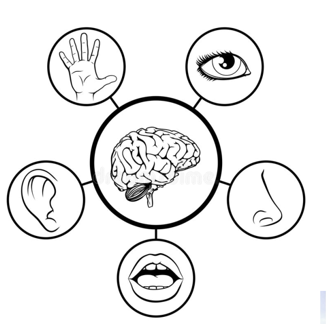
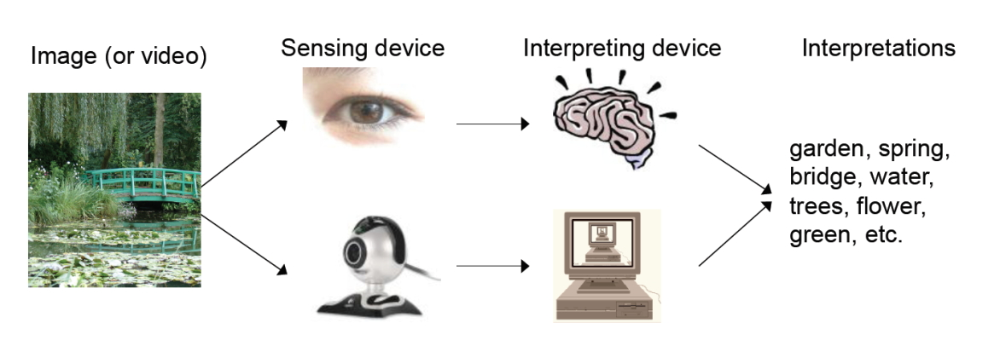
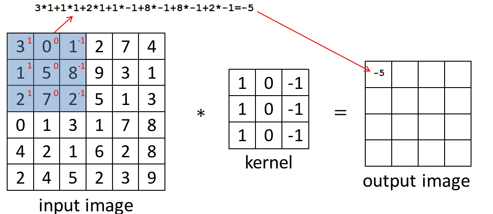

### 電腦視覺

***

人工智慧概念上,利用人造的裝置，體驗五感(眼,耳,鼻,舌,觸覺),藉著判斷協助人類做決策。電腦視覺是代表神類視覺。Sensor (或是感測元件也是這波人工智慧浪潮下,會受益).十鳥在林不如一鳥在手。專注本業 Linking 可能在才是王道。

 傳統影像處理下,Filter 的設計與視覺呈現有許多的技巧，因為人工智能的關係，大家關切在分類與識別上，如莊永裕教授所介紹的其實基礎的影像計算與處理的方式也是可以運用類神經來處理。 Conversion 