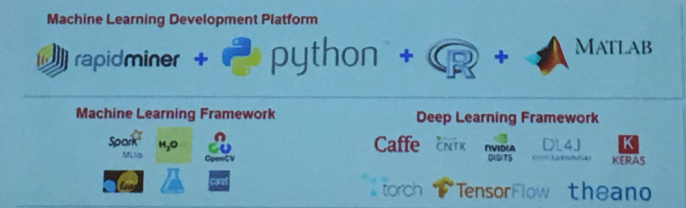
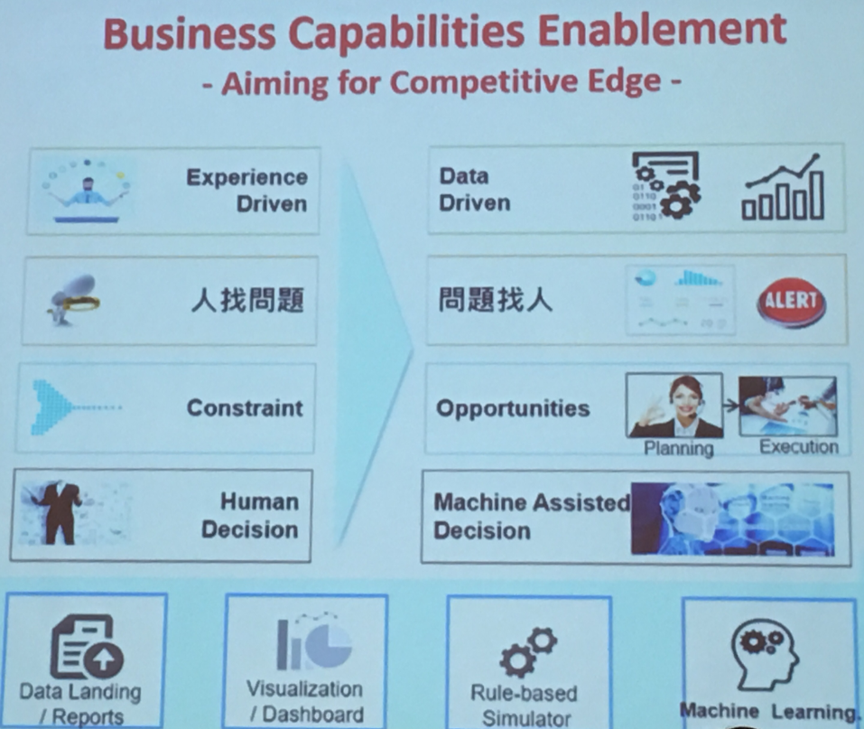
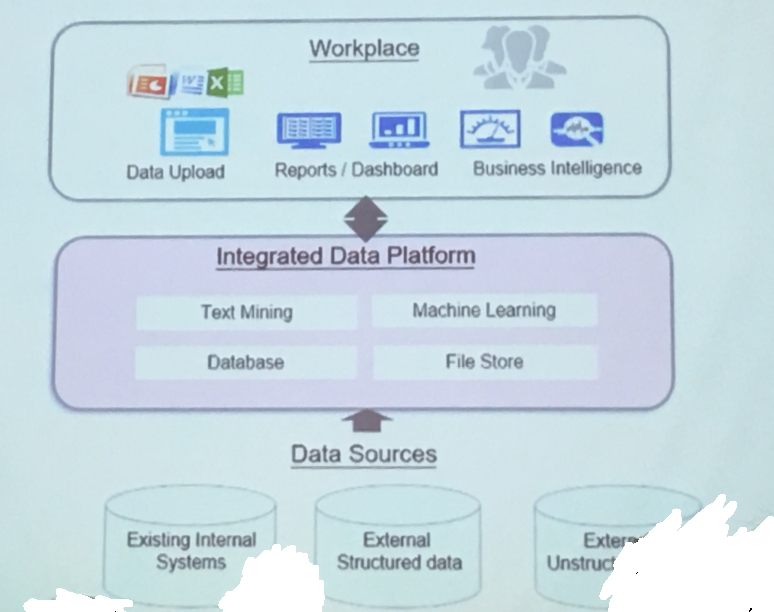

Digital Transformation - 2018/11/10 @CIO 

***

參加了 CIO 協會價值學院今年的最後一場研討會，重頭戲是台積電分享關於台積的數位轉型。幾個指標數字值得思考，台機衡量的面向有四點

+ Accuracy : Delivery 95 > 99.3
+ Productivity :  操作員人機比由 1:3 提升到 1:80
+ Agility : super hot lot capacity from 120 to 800
+ Quality : Particle count reduce 80%

2013 年導入 Big data 降低了 65% 的工程師 loading , Workflow automation & collaboration platform, 2016 年導入 Machine learning 提升的品質減少的 Cycle Time. 除一般的機台上報資訊外,另外將所有機台 Log 收到 Server 包含非結構化的影像資料。這邊使用了 Hadoop 為並自行開發平台。工具上大量使用 Open Source  

Case Sharing 上 AOI 與 CMP R2R 是講爛了了題目，工程上推薦系統會,收集 Event 記錄 root case & action, Reviewer SOPs 建立 Solution liability. Leveraging txt mining 的技術處理非結構資訊, 當 Event 發生推薦過去類似的Case 與資訊給工程師。以此為方向，將人員驅動變更為數據驅動,讓人與系統協同合作。

Business 上的非結構化資料一直是IT 們頭痛的問題，方法上仍以提供 BI 的工具平台讓 User 自助，但是另外一方面在藉由集中資料在 Data Center 讓資料來源統一，達到數字一致性。 雲端與行動應用上，分享了 QRCode 與影像辨識，管理處理零件庫存，統一調度零件。與建議多使用 Open Source 與 Google 與 AWS 等雲端 AI 的工具加速系統的開發。 

