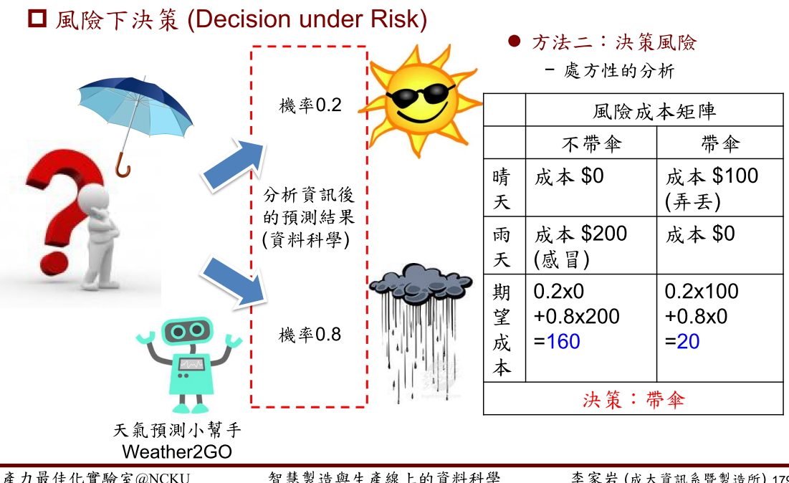

智慧製造與生產線上的資料科學 - 李家岩 博士

2018-05-05 筆記

 

##### 自動化的製造哲學 - 透過消除浪費、降低產線不平衡、達到生產標準化且具有彈性的

管理當 Focus 在變異(Variability)，工廠盡可能想以自動化來來降低工廠的變異與減低人力成本。在自動化前  Lean 精實生產也是自動化的一環 ，檢視流程定義沒有價值並移除，就是一種自動化並非一定得投資設備，有時候只是資料流的Link 與揭露一些額外的資訊供上下站點參考。 製造管理主要的兩個維度。

+ + 製程控制
  + 生產管理

		

##### 問題本質的探討與知識的內化

管理製造現場是一種修行，特別是在剝洋蔥時，夠嗆夠辣。回答的問題千奇百怪。脫離不了撇清責任與把工作往外推。世代間價值觀的差異，*公司衡量員工 CP 值，現在員工也在衡量公司間的 CP 值，不是不會，是不想。* 資料要能對應到現場的特性與問題，區分出行為類型找對整理的方式。 

| 平行 | 黃金 | 處方 | 抽樣 | R&D  | 維修 | 換模 | 等候 | 合併 | 不平衡 | 瓶頸 |
| ---- | :--: | :--: | ---- | :--: | :--: | :--: | :--: | :--: | :----: | :--: |
|      |      |      |      |      |      |      |      |      |        |      |

#### 良率預測架構

#### 從預測性思維到處方性決策(From Predictive to Prescriptive)

為什麼預測，預測的目的，預測的下一步 ? 所以預測的目的是透過分析資訊來降低未來不確定性
，以利決策的進行。預測前最重要的步驟是***動起來***開始收集資訊。 決策可分為在應用的時須**搭配決策風險**

+ 確定性下決策 (Decision under Certainty)

+ 風險下決策 (Decision under Risk) 

+ 完全不確定下決策 (Decision under Strict Uncertainty)

  

預測為了降低對未來的不確定性 (建構關鍵因子推論的預測模型) &  提升決策品質(建構風險權衡最佳化的決策模型)

>  薩維基準則 (The Minimax Regret Criterion) (Savage, 1951)
>
> 又稱最小最大悔惜準則
>
> + 悔惜定義為「一決策方案之報酬與相同自然狀態下可以產生最大報酬之決策方案，兩者報酬的差額
> + Step 1：建立悔惜償付表
> + Step 2：在悔惜償付表中採大中取小準則(minimax)

##### 參考資料

[Regret (decision theory)](https://en.wikipedia.org/wiki/Regret_(decision_theory)) [智慧製造與生產線上的資料科學](智慧製造與生產線上的資料科學.pdf) 

