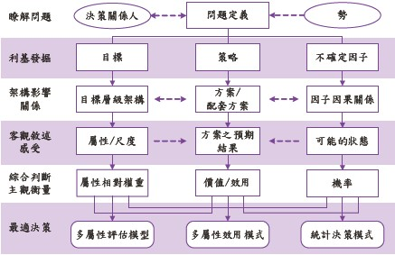

數位決策與紫式分析架構

***

決策的價值與挑戰在於一開始的定義問題，隱含在表象下的真正的問題，找到對的人，做對的事，跟把事情做對。

定義問題(5W) + 利害關係人與資源、成本、效益、風險

決策情境(勢)即決策元素(變動因子)

決策限制(形)，即資源(預算、成本、設備、時間、法規)

決策關係人包含決策者，參與者，執行者，受決策影響者，與決策權限與當責

決策定義域(形+勢+人) ，天時，地利、人和 ? 發覺利基找到突破點

決策偏差

被自己的過去成功的經驗綁架，成功經驗成為決策陷阱 形而上的內隱智慧和經驗結晶，主管直接分享案例分析傳承決策智慧 瑞士起司模型(Swiss Cheese Model) 各單位小疏漏，剛好在同一個時間與地點，連串連鎖錯誤導致巨大災禍

紫式決策分析架構

