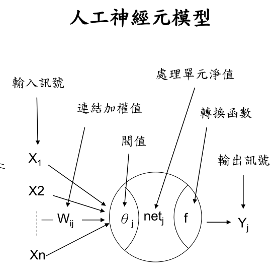

關於 ML 的基本概念

***

機器學習與統計分析的差異，這個問題其實還沒了解，網路上的一些解釋。不過最後的目的都是從數據獲得知識進而協助判斷與決策。

資料探勘利用自動或是半自動的方式來探索和分析龐大的資料而從中去發現特殊的模式、關聯性、變化、異常以及顯著的結構性等以及發現專家們尚未知曉的新關係  (Berry  and Linoff, 1997;  簡禎富等，民 90)。 
資料挖礦所處理的問題類型，可以歸納為預測  (prediction)、分類  (classification)、分群(clustering)  以及關聯分析  (dependency  analysis)  等。資料挖礦的主要技術，包括統計方法(statistics)、人工智慧  (artificial  intelligence)、決策樹  (decision  tree)、類神經網路  (neural network)、基因演算法  (genetic  algorithm)、關聯規則  (association  rule)  與視覺化  (visualization) 等。

機器學習是一門涉及自學習演算法發展的科學。這類演算法本質上是通用的，可以應用到眾多相關問題的領域。 統計學是一門研究怎樣收集，組織，分析和解釋資料中的數字化資訊的科學。統計學可以分為兩大類：描述統計學和推斷統計學。描述統計學涉及組織，累加和描繪資料中的資訊。推斷統計學涉及使用抽樣資料來推斷總體

機器學習：一種不依賴於規則設計的數據學習算法關注模型的預測能力  統計模型：以數學方程形式表現變量之間關係專注模型的可解釋性 

人工智慧這門科學的目的在於開發一個模擬人類能在某種環境下做出反應和行為的系統或軟體。由於這個領域極其廣泛，人工智慧將其目標定義為多個子目標。然後每個子目標就都發展成了一個獨立的研究分支。

深度學習（深度神經網路）是讓電腦可以自行分析資料找出「特徵值」，而不是由人類來決定特徵值，而深度學習使用多層神經網路，理論上隱藏層愈多自由度與精確度愈高，但是結果相反，因為誤差反向傳播（EBP）很難傳遞回更上一層的神經元，當階層太多時效果不佳。因此深度學習不但使用多層神經網路，同時使用「自動編碼器」（Autoencoder）來進行「非監督式學習」（Un-supervised learning）。

人工智慧所要完成的主要目標列表（亦稱為AI問題）

1. Reasoning（推理） 
2. Knowledge representation（知識表示） 
3. Automated planning and scheduling（自動規劃）
4. Machine learning（機器學習） 
5. Natural language processing（自然語言處理） 
6. Computer vision（計算機視覺）
7. Robotics（機器人學） 
8. General intelligence or strong AI（通用智慧或強人工智慧）

類神經網路四大類型

+ 監督式學習(Supervised learning)
  + 感知機網路（Perception）
  + 倒傳遞網路（Back-propagation Network）
  + 機率神經網路（Probabilistic Neural Network）
  + 學習向量量化網路（Learning Vector Quantization)
  + 反傳遞網路（Counter- propagation Network）
+ 非監督式學習(Unsupervsed learning)
  + 自組織映射網路（Self-Organization Map）
  + 自 適 應 共 振 理 論 網 路 （ Adaptive Resonance
    theory Network）
+ 聯想式學習(Associated learning)
  + 霍普菲爾網路（Hopfield Neural Network）
  + 雙向聯想記憶網路（Bi-directional Associative
    Memory）
+ 最適化應用網路(Optimiztion learning)
  + 霍普菲爾-坦克網路（Hopfield –Tank Neural
    Network）
  + 退火神經網路（Annealed Neural Network）

#### 參考資料

[人工智慧簡史](https://www.inside.com.tw/2017/07/10/ai-history) [機器學習VS統計模型 ](https://kknews.cc/zh-tw/tech/gz22r3y.html) [人工智慧\機器學習\統計學\資料探勘之間有什麼區別](https://itw01.com/A48ESDF.html) [機器學習與深度學習](https://technews.tw/2017/10/05/ai-machine-learning-and-deep-learning/) [圖解 27 種神經模型，讓你秒懂差在哪](https://buzzorange.com/techorange/2018/01/24/neural-networks-compare/) [AI---從寒冬到復興](https://www.bnext.com.tw/article/47478/ai-history--rise-and-fall) 